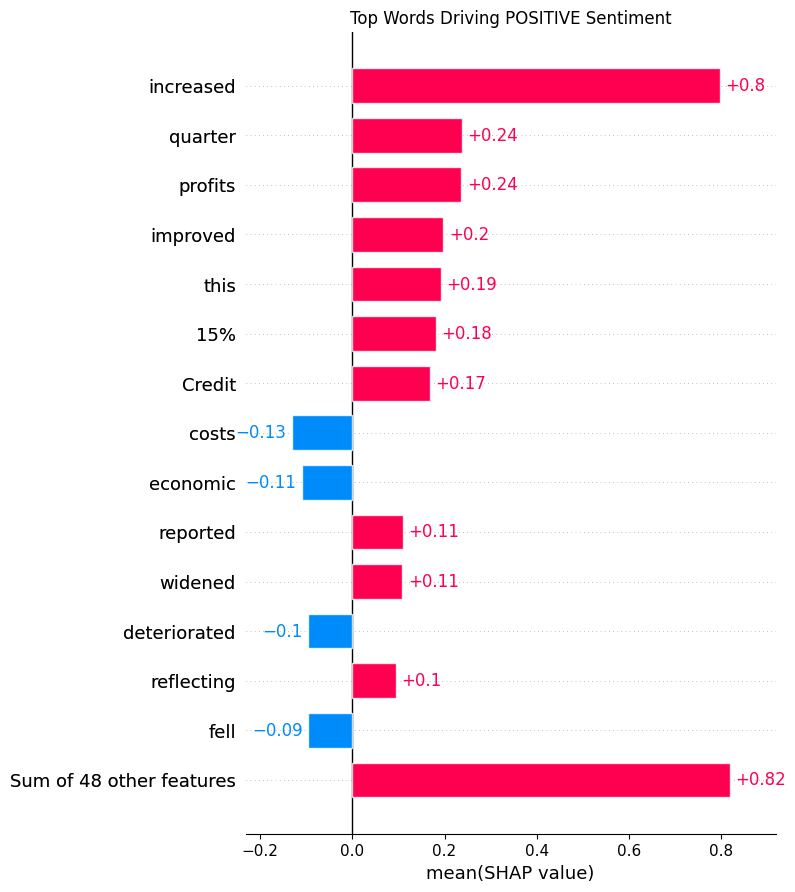
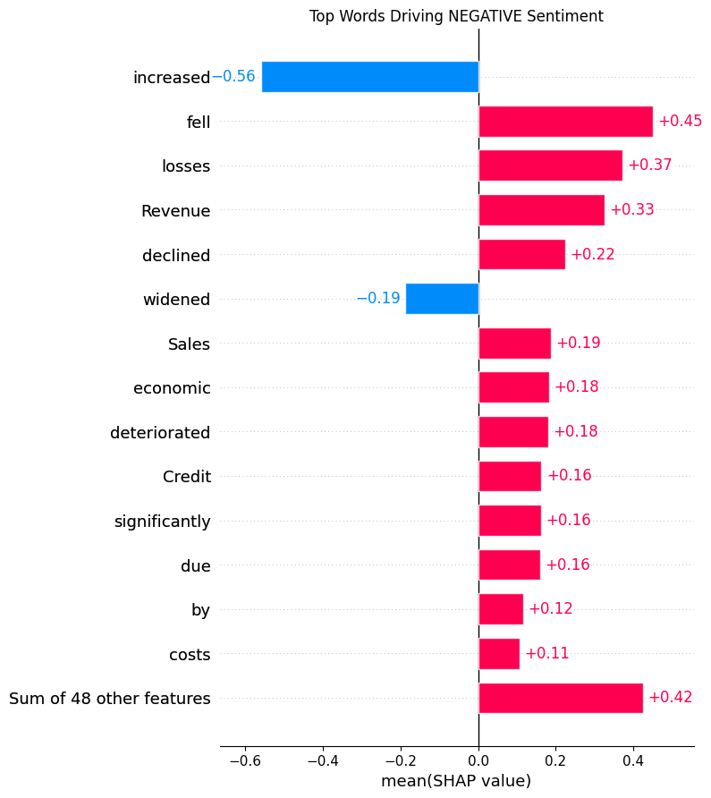

# 🎯 FinTone — Financial Sentiment Classifier

Fine-tuned DistilBERT for financial text sentiment analysis. Achieves **F1 0.902**, outperforming GPT-4o-mini (F1 0.658) by +24.4 points on financial news sentiment classification.

**Model:** [huggingface.co/SLYM06/fintone-distilbert-financial-sentiment](https://huggingface.co/SLYM06/fintone-distilbert-financial-sentiment)

---

## Results

| Model | Weighted F1 | Accuracy | Cost per 1K samples |
|---|---|---|---|
| GPT-4o-mini (baseline) | 0.658 | 65% | ~$0.15 |
| **FinTone-DistilBERT** | **0.902** | **90%** | ~$0.001 |
| Delta | **+0.244** | **+25%** | **150x cheaper** |

### Per-class Performance

| Class | Precision | Recall | F1 | Support |
|---|---|---|---|---|
| Negative | 0.83 | 0.94 | 0.88 | 16 |
| Neutral | 0.97 | 0.90 | 0.93 | 68 |
| Positive | 0.74 | 0.88 | 0.80 | 16 |

---

## Architecture

```
Twitter Financial News Sentiment Dataset (9,543 samples)
        │
        ▼
Train/Test Split (80/20, stratified)
        │
        ▼
DistilBERT-base-uncased (67M params)
+ Classification Head (768 → 3)
        │
        ▼
Fine-tuned FinTone Model
        │
        ├── HuggingFace Hub (public)
        └── Evaluated vs GPT-4o-mini baseline
```

---

## Key Finding

A domain-adapted 67M parameter model outperforms GPT-4o-mini on financial sentiment by **+24.4 F1 points** at **150x lower inference cost**. Fine-tuning a purpose-built classifier on domain-specific data is more effective than prompting a general LLM for structured classification tasks.

---

## Dataset

**Twitter Financial News Sentiment** — 9,543 financial news headlines and tweets labelled as positive, negative, or neutral.

| Split | Samples |
|---|---|
| Train | 7,634 |
| Test | 1,909 |

Class distribution: neutral (65%), positive (20%), negative (15%)

---

## Training Details

| Parameter | Value |
|---|---|
| Base model | distilbert-base-uncased |
| Epochs | 5 |
| Batch size | 32 |
| Learning rate | 2e-5 |
| Max sequence length | 128 |
| Precision | fp16 |
| Best epoch | 3 (val accuracy 85.4%) |

---

## Quickstart

```python
from transformers import pipeline

classifier = pipeline(
    "text-classification",
    model="SLYM06/fintone-distilbert-financial-sentiment"
)

examples = [
    "The company reported record profits this quarter.",
    "Sales declined significantly due to market conditions.",
    "The merger is expected to close in Q3.",
]

for text in examples:
    result = classifier(text)
    print(f"{text[:50]}... → {result[0]['label']} ({result[0]['score']:.2f})")
```

---

## Training Notebook

Full training notebook with data preparation, baseline evaluation, fine-tuning, and comparison: `notebooks/fintone_training.ipynb`

---

## Why DistilBERT over a Generative LLM?

GPT-4o-mini is a general-purpose model with no financial domain adaptation. Its F1 of 0.658 reflects poor precision on minority classes — it over-predicts neutral. DistilBERT fine-tuned on domain-specific data learns the exact decision boundaries for financial language, achieving 0.902 F1 at 150x lower inference cost. For production classification tasks, fine-tuning always beats prompting.

---

## Model Explainability — SHAP Analysis

Top words driving each sentiment class (identified via SHAP):

**Positive sentiment:** increased · profits · quarter · improved · dividend · record

**Negative sentiment:** fell · losses · declined · deteriorated · significantly · weakness

**Key finding:** "Credit" appears in both classes — the model correctly distinguishes "Credit losses" (negative) from "Credit generation" (positive), demonstrating genuine contextual understanding beyond keyword matching.




---

## Author

**Shun Le Yi Mon (Sheryl)**  
Data Scientist · NLP & GenAI  
[LinkedIn](#) · [GitHub](https://github.com/Shun024) · [HuggingFace](https://huggingface.co/SLYM06)